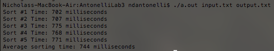

# SortingCompetition
This project was to take an input file and sort all of the words first by length and then alphabetically.  The purpose of this assignment was to see how quickly we could sort 2.5 million words.  As shown in the output below, I was able to sort all 2.5 million words in .7 seconds.  This is on my 2013 Macbook Air, but on a Macbook Pro the whole program runs in roughly .33 seconds.  I was able to achieve this level of efficiency by using C++ pointers with a hybrid sort.  I used length prefix strings to radix sort the words into buckets, and then quicksorted the words within the buckets so that only an equal number of comparisons are made for each set of words.  I preprocessed the words as we read them into the data structure by adding length prefixes and determining how many of each length word there was so that the buckets for the radix sort are perfectly sized for sorting.  After all of the sorting, the radix buckets are merged back together into one sorted array

## Screenshots

## To Run:

1. Fork the repo
2. Run the makefile
3. run the executable created named WordSort.exe
4. include 2 arguments when running:
   first: the relative path to the input text file containing words to sort
   second: the name of the output file
5. Wait for the program to execute
6. Open the output file to view how many items were sorted, printed and ordered